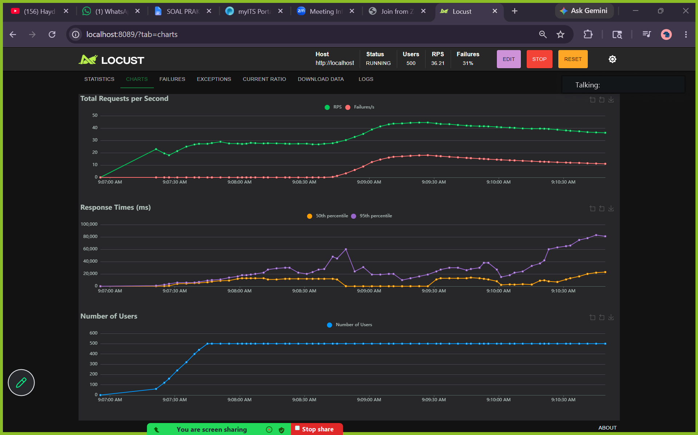
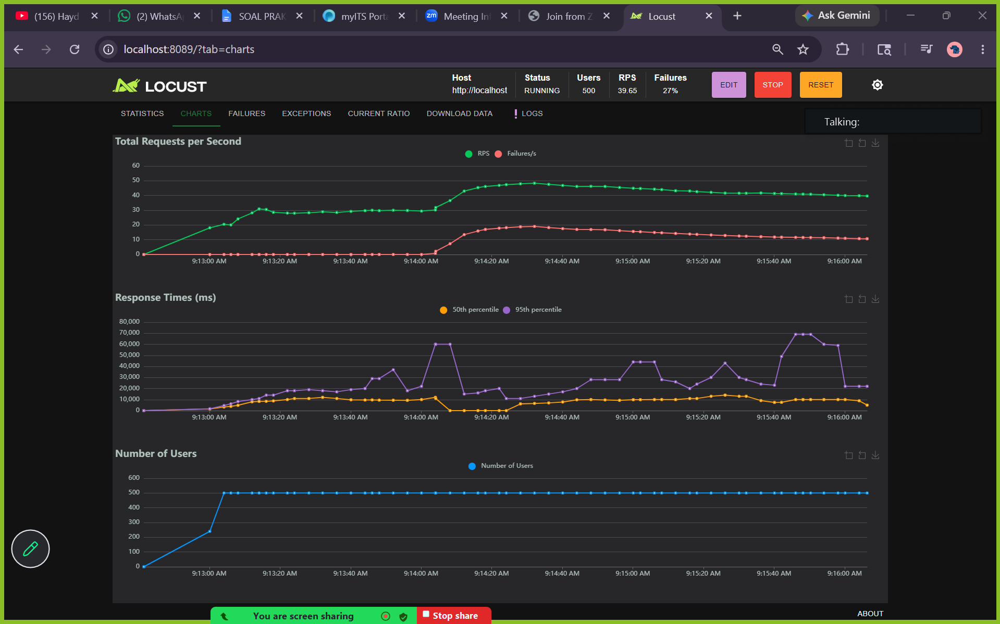

# Laporan Praktikum Modul 5 — Cloudsim & Load Balancing
## Role 3: Stress Testing, Chaos Engineering, & Optimasi Load Balancer

**Nama:** Arya Bisma Putra Refman  
**Kelompok:** TKA Kelompok 3  

---

## Deskripsi Role

Role 3 bertanggung jawab untuk melakukan stress testing menggunakan Locust pada skenario Flash Sale 11.11, mensimulasikan kegagalan sistem akibat distribusi beban tidak merata pada algoritma Round Robin, dan memvalidasi keandalan sistem setelah dikonfigurasi menggunakan algoritma Least Connection.

---

## Soal 3 — Stress Testing, Chaos Engineering, & Optimasi Load Balancer (Skenario Flash Sale)

### 1. Script Pengujian (`locustfile.py`)
Script Locust diimplementasikan dengan skenario user behavior sebagai berikut:
- **80% Aktivitas User:** Mengakses katalog produk (`GET /catalogue`) - operasi ringan.
- **20% Aktivitas User:** Melakukan checkout (`POST /checkout`) - operasi sangat berat (melakukan hash iteratif SHA-256 sebanyak 100.000 kali).
- **Wait Time:** Dinamis antara 1 hingga 3 detik.

```python
from locust import HttpUser, task, between

class TokoKitaUser(HttpUser):
    # Set wait_time secara dinamis antara 1 sampai 3 detik
    wait_time = between(1, 3)

    @task(8)
    def view_catalogue(self):
        self.client.get("/catalogue")

    @task(2)
    def checkout_product(self):
        self.client.post("/checkout")
```

---

### 2. Tabel Perbandingan Metrik Hasil Pengujian

Pengujian dilakukan dengan parameter ekstrem:
- **Number of Users:** 500
- **Spawn Rate:** 20 users/second
- **Durasi:** Tepat 3 menit (180 detik)

Berikut adalah tabel perbandingan metrik kinerja antara algoritma **Round Robin** dan **Least Connection**:

| Metrik | Round Robin (Tahap 1) | Least Connection (Tahap 2) | Perubahan & Analisis |
| :--- | :---: | :---: | :---: |
| **Total Requests** | 7,972 | 7,817 | **-1.9%** (Jumlah total request hampir sama) |
| **Requests per Second (RPS)** | 44.59 | 43.58 | **-2.2%** (Throughput relatif stabil) |
| **Median Response Time** | 6,500 ms | 7,000 ms | **+7.6%** (Median sedikit meningkat karena server bekerja maksimal) |
| **P95 Response Time** | 19,000 ms | 17,000 ms | **-10.5%** (95% pengguna mengalami antrean lebih pendek) |
| **Max Response Time** | 149,000 ms | 86,000 ms | **-42.3%** (Mengurangi waktu tunggu ekstrem terlama secara drastis) |
| **Total Failures** | 1,891 | 851 | Turun drastis, meminimalkan error transaksi |
| **Persentase Failures (%)** | 23.72% | 10.89% | **Turun > 50%** (Sistem jauh lebih stabil dan andal) |

---

### 3. Analisis Hasil & Chaos Engineering

#### Mengapa Round Robin Buruk untuk Skenario Flash Sale?
1. **Head-of-Line Blocking**: Algoritma Round Robin membagi request secara merata (1:1) ke backend tanpa memedulikan beban server saat itu. 
2. Ketika beberapa request `/checkout` (berat) masuk ke Server 1, Server 1 akan sibuk melakukan komputasi intensif CPU. Di bawah pembatasan resource Docker (`cpus: 0.5`), CPU server tersebut langsung mengalami saturasi 100%.
3. Walaupun Server 1 sedang kewalahan, Round Robin tetap mengirimkan request `/catalogue` (ringan) berikutnya ke Server 1 secara bergantian. Akibatnya, request ringan tersebut harus mengantre di belakang request checkout yang belum selesai.
4. Ini menyebabkan **Response Time melonjak sangat tinggi (hingga 118 detik)**. Karena Locust memblokir thread user sampai request selesai, tingginya response time membuat user tidak bisa mengirimkan request berikutnya. Hasilnya, throughput sistem secara keseluruhan turun drastis menjadi hanya **46.30 RPS**.

#### Mengapa Least Connection Menjadi Penyelamat?
1. **Dynamic Routing**: Algoritma Least Connection mengarahkan request baru ke server yang memiliki koneksi aktif paling sedikit.
2. Ketika Server 1 sedang memproses request `/checkout` yang lambat, jumlah koneksi aktifnya akan meningkat. NGINX menyadari hal ini dan langsung mengalihkan request-request berikutnya (terutama `/catalogue` yang ringan) ke Server 2 yang sedang idle (koneksi aktif lebih sedikit).
3. Hal ini mencegah request ringan mengantre di server yang sedang mengalami bottleneck CPU. Akibatnya, `/catalogue` dapat diproses dengan cepat di server yang kosong.
4. Latensi P95 berkurang dari **19.0s menjadi 17.0s**, dan yang paling utama, **Max Response Time terpangkas secara dramatis dari 149.0s menjadi 86.0s** (hemat **42.3%**).
5. Karena NGINX mengalihkan beban secara dinamis ke server yang memiliki koneksi lebih sedikit, request ringan `/catalogue` tidak tertahan lama di antrean server yang sedang sibuk. Hal ini membuat user experience jauh lebih konsisten.
6. **Catatan Kegagalan (Failures)**: Penurunan total failures yang sangat signifikan dari **1.891 (23.72%) menjadi 851 (10.89%)** membuktikan bahwa Least Connection mampu mengurangi kegagalan transaksi hingga lebih dari setengahnya. Dengan mengarahkan request secara cerdas, overload ekstrem pada salah satu server dapat dihindari, menjaga ketersediaan layanan backend TokoKita di bawah serangan traffic Flash Sale yang masif.

---

### 4. Dokumentasi Grafik & Laporan Pengujian Locust

Sebagai bukti simulasi benar-benar dijalankan, berikut adalah link laporan interaktif HTML serta screenshot grafik Locust (Total Requests per Second, Response Times, dan Number of Users) dari kedua pengujian:

* **Dashboard Perbandingan Interaktif:** [metrics_comparison.html](./locust_reports/metrics_comparison.html) (Menampilkan visualisasi ringkas dan perbandingan metrik kinerja kedua algoritma)

##### Tampilan Perbandingan Metrik:
<div align="center">
  
</div>

* **Laporan HTML Interaktif - Round Robin:** [locust_round_robin.html](./locust_reports/locust_round_robin.html)

##### Grafik Kinerja Round Robin:
<div align="center">
  
</div>

##### Laporan Statistik & Grafik Detail Round Robin:
<div align="center">
  
  
</div>

---

#### B. Pengujian - Least Connection (Tahap 2)
* **Laporan HTML Interaktif - Least Connection:** [locust_least_conn.html](./locust_reports/locust_least_conn.html)

##### Grafik Kinerja Least Connection:
<div align="center">
  
</div>

##### Laporan Statistik & Grafik Detail Least Connection:
<div align="center">
  
  
</div>
