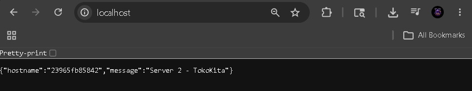
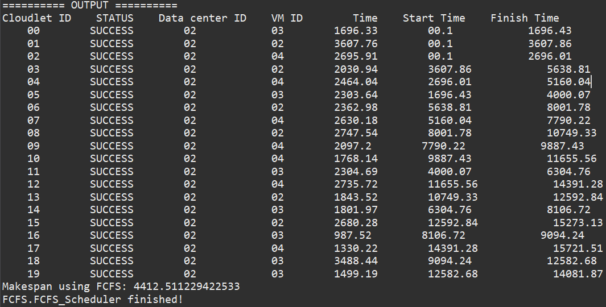
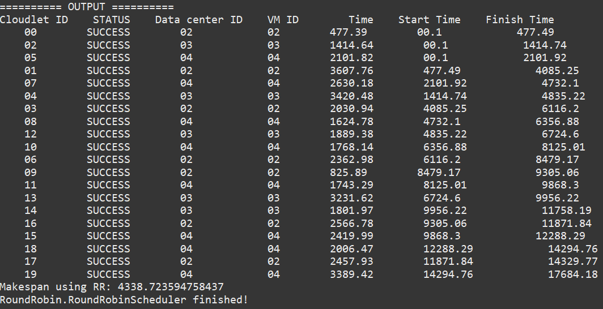
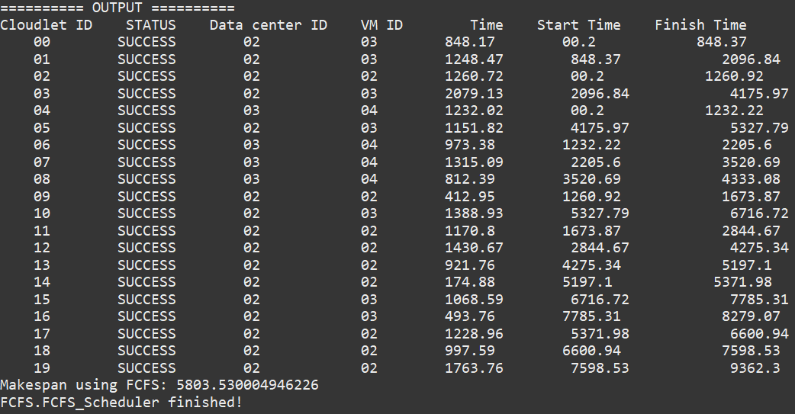

# Laporan Praktikum Modul 5 — Cloudsim & Load Balancing
## Role 1: Backend & Docker

**Nama:** Evan Christian Nainggolan  
**Kelompok:** TKA Kelompok 3    

---

## Deskripsi Role

Role 1 bertanggung jawab atas pembuatan aplikasi backend Flask, konfigurasi Dockerfile untuk setiap service, dan pengaturan resource limits pada Docker Compose. Output dari role ini menjadi fondasi yang digunakan oleh Role 2 (NGINX & CloudSim) dan Role 3 (Locust Testing).

---

## Soal 1 — Aplikasi Backend Dasar (Flask)

### Struktur Folder yang Dibuat

```
TokoKita/
├── backend1/
│   ├── Dockerfile
│   ├── main.py
│   └── requirements.txt
├── backend2/
│   ├── Dockerfile
│   ├── main.py
│   └── requirements.txt
├── nginx/
│   ├── Dockerfile
│   └── nginx.conf
└── docker-compose.yml
```

### Penjelasan Aplikasi

Setiap backend adalah aplikasi Flask yang berjalan di port 5000 di dalam container. Keduanya mengembalikan data yang sama tapi dengan identitas server yang berbeda, sehingga saat load balancer NGINX membagi traffic, perbedaan server bisa terlihat jelas.

### Source Code `backend1/main.py`

```python
from flask import Flask, jsonify, request
import socket
import hashlib

app = Flask(__name__)

products = [
    {"id": 1, "name": "Laptop", "price": 12000000},
    {"id": 2, "name": "Mouse", "price": 150000},
    {"id": 3, "name": "Keyboard", "price": 350000}
]

@app.route('/')
def home():
    return jsonify({
        "message": "Server 1 - TokoKita",
        "hostname": socket.gethostname()
    })

@app.route('/products')
def get_products():
    return jsonify(products)

@app.route('/catalogue')
def catalogue():
    return jsonify({
        "server": "Server 1 - TokoKita",
        "hostname": socket.gethostname(),
        "products": products
    })

@app.route('/checkout', methods=['POST'])
def checkout():
    result = "start"
    for i in range(100000):
        result = hashlib.sha256(f"{result}{i}".encode()).hexdigest()
    return jsonify({
        "server": "Server 1 - TokoKita",
        "hostname": socket.gethostname(),
        "status": "success",
        "message": "Checkout berhasil diproses",
        "order_id": result[:8]
    })

if __name__ == '__main__':
    app.run(host='0.0.0.0', port=5000)
```

> `backend2/main.py` identik dengan backend1, perbedaannya hanya pada identitas server yang menampilkan `"Server 2 - TokoKita"`.

### Source Code `Dockerfile` (sama untuk backend1 dan backend2)

```dockerfile
FROM python:3.9-slim
WORKDIR /app
COPY . /app
RUN pip install -r requirements.txt
CMD ["python", "main.py"]
```

### Source Code `requirements.txt` (sama untuk backend1 dan backend2)

```
flask
```

---

## Soal 3 — Modifikasi untuk Flash Sale (Stress Testing)

### Endpoint Baru yang Ditambahkan

| Endpoint | Method | Deskripsi |
|---|---|---|
| `/catalogue` | GET | Ringan — mengembalikan JSON daftar produk |
| `/checkout` | POST | Berat — menjalankan 100.000 iterasi hash SHA-256 untuk mensimulasikan beban CPU tinggi |

### Alasan Menggunakan Hash Iteratif untuk `/checkout`

Endpoint `/checkout` menggunakan perulangan komputasi hash SHA-256 sebanyak 100.000 kali. Ini dipilih karena membebani CPU secara nyata tanpa menggunakan `time.sleep()`, sehingga simulasi beban yang dihasilkan lebih realistis dan sesuai ketentuan soal.

### Konfigurasi Resource Limits di `docker-compose.yml`

```yaml
services:
  backend1:
    build: ./backend1
    ports:
      - "5001:5000"
    deploy:
      resources:
        limits:
          cpus: '0.5'
          memory: 128M

  backend2:
    build: ./backend2
    ports:
      - "5002:5000"
    deploy:
      resources:
        limits:
          cpus: '0.5'
          memory: 128M

  nginx:
    build: ./nginx
    ports:
      - "80:80"
    depends_on:
      - backend1
      - backend2
```

### Penjelasan Resource Limits

| Parameter | Nilai | Artinya |
|---|---|---|
| `cpus: '0.5'` | 0.5 core | Container hanya bisa memakai maksimal 50% dari 1 CPU core |
| `memory: 128M` | 128 Megabyte | Container hanya bisa memakai maksimal 128MB RAM |

Pembatasan ini membuat backend mudah mencapai batas kapasitas saat diuji dengan traffic tinggi menggunakan Locust (dikerjakan Role 3), sehingga perbedaan performa antara algoritma Round Robin dan Least Connection dapat terlihat dengan jelas.

---

## Hasil Pengujian

### 1. Pengujian Weighted Round Robin (`localhost/`)

Berikut hasil akses `localhost/` sebanyak 4 kali untuk membuktikan pola distribusi 3:1 (backend1 mendapat 3x lebih banyak request dibanding backend2):

> **[Screenshot 1 — Tampilan localhost/ — Server 1 (request ke-1)]**
>
<div align="center">
  
</div>

> **[Screenshot 2 — Tampilan localhost/ — Server 1 (request ke-2)]**
>
<div align="center">
  
</div>

> **[Screenshot 3 — Tampilan localhost/ — Server 1 (request ke-3)]**
>
<div align="center">
  
</div>

> **[Screenshot 4 — Tampilan localhost/ — Server 2 (request ke-4, sesuai pola weight=1)]**
>
<div align="center">
  
</div>

### 2. Pengujian Endpoint `/products`

> **[Screenshot 5 — Tampilan localhost/products menampilkan daftar produk JSON]**
>
<div align="center">
  
</div>

### 3. Pengujian Endpoint `/catalogue` (Soal 3)

> **[Screenshot 6 — Output endpoint /catalogue]**
>
<div align="center">
  
</div>

### 4. Pengujian Endpoint `/checkout` (Soal 3)

> **[Screenshot 7 — Output endpoint /checkout menampilkan status success dan order_id]**
>
<div align="center">
  
</div>

---

## Kesimpulan Role 1

Semua komponen backend berhasil dibuat dan berjalan dengan benar:

- Endpoint `/` dan `/products` berfungsi untuk Soal 1, menampilkan identitas server dan daftar produk
- Endpoint `/catalogue` dan `/checkout` berfungsi untuk Soal 3, dengan `/checkout` berhasil mensimulasikan beban CPU berat menggunakan hash iteratif
- Resource limits berhasil dikonfigurasi di `docker-compose.yml` dengan maksimal 0.5 CPU dan 128MB Memory per backend
- Seluruh source code siap digunakan oleh Role 2 untuk konfigurasi NGINX dan Role 3 untuk eksekusi Locust stress testing

## Role 2: Implementasi Task Scheduling dengan Cloudism

**Nama:** Reza Aziz Simatupang 

**Kelompok:** TKA Kelompok 3    

---
## Soal 1 — Setup Lingkungan 

* Eclipse IDE
* CloudSim 3
* commons-math 3.6.1

## Soal 4 — Hasil Output 

| Informasi         | FCFS   | Round Robin |
|-------------------|--------|--------------|
| Makespan          | 4412   | 4338         |
| Jumlah Cloudlet   | 20     | 20           |
| Status Cloudlet   | Success| Success      |

**Dokumentasi**
> **[Screenshot — Output FCFS]**
>
<div align="center">
  
</div>

> **[Screenshot — Output RR]**
>
<div align="center">
  
</div>

## Soal 5 — Modifikasi Spesifikasi VM
> **[Screenshot — Output FCFS]**
>
<div align="center">
  
</div>

---

## Kesimpulan Role 2

Perbedaan makespan terjadi karena distribusi cloudlet pada simulasi masih bersifat random dan scheduler yang digunakan adalah `SpaceShared`, sehingga cloudlet harus dieksekusi secara bergantian dalam VM. Akibatnya, meskipun spesifikasi VM sudah ditingkatkan, antrean task tetap dapat terjadi dan makespan bisa meningkat tergantung beban kerja yang diterima pada setiap simulasi.
